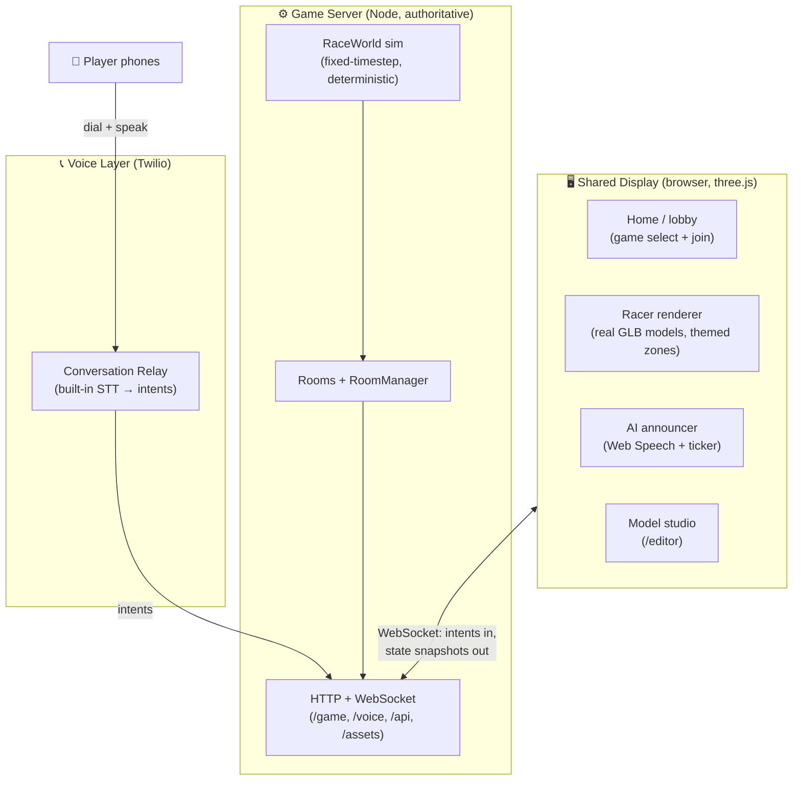

<div align="center">

# 🏎️ Twilio Games — Voice Racer

**Voice-controlled, multiplayer party games for live events — powered by Twilio.**

Up to 8 players control real 3D cars on one shared screen by *calling in and speaking* —
"left!", "right!", "boost!" — while an AI host calls the race live.


</div>

---

## What this is

A platform of voice-controlled games designed to **showcase Twilio products at IRL events**.
The first (and current) game is **Voice Racer**: a lane-based "dodge-and-grab" race. Cars
auto-drive forward; players steer between lanes by voice to dodge red barriers and grab green
boost pads. First across the line wins.

The headline trick is the control scheme: players don't use a gamepad — each player is on a
**phone call**, and their spoken commands become car movements. The game is deliberately
designed to be *latency-tolerant* (lanes, not fine steering; hazards visible ahead) so it feels
good even with real voice round-trip delay.

> **Why voice + lanes?** A spoken "left" takes ~250ms–1s to land. That's hopeless for
> frame-by-frame steering but perfect for *intentions* ("move to the inside lane", "boost
> now"). The whole game is built around that constraint — see `docs/superpowers/specs/`.

## Architecture

Three cleanly separated layers, connected by an abstract **intent** seam
(`MOVE_LEFT`, `MOVE_RIGHT`, `BOOST`, `BRAKE`, `USE_POWER`). The game consumes intents and never
knows their source — keyboard, or Twilio voice, are just adapters.



- **`shared/`** — pure, deterministic game logic + the typed protocol. No I/O. Reused by server
  and client. (`race-world.ts`, `zones.ts`, `asset-manifest.ts`, `asset-fit.ts`, `types.ts`.)
- **`server/`** — authoritative simulation + transport. Owns the truth (fairness/anti-cheat,
  online-ready). (`game-server.ts`, `http-server.ts`, `room.ts`, `conversation-relay.ts`.)
- **`client/`** — the browser: home page, three.js renderer, asset loader, AI announcer, and the
  model editor. Renders server snapshots; sends intents.
- **`tools/`** — asset pipeline CLIs (inspect / optimize GLB models).

## Quick start

Requires **Node ≥ 20**.

```bash
npm install

# Terminal 1 — game server (WebSocket + asset/manifest API) on :8080
npm run dev:server

# Terminal 2 — client (Vite) on :5173
npm run dev:client
```

Then open **http://localhost:5173/** — the home page. From there:

| Page | URL | What it is |
|------|-----|------------|
| **Home** | `/` | Branded landing + game selection + join form |
| **Racer** | `/play.html?display=1&room=4821` | The shared display (spectator + operator console) |
| **Racer (player)** | `/play.html?room=4821&name=Ada` | A keyboard player (dev/testing) |
| **Model studio** | `/editor/editor.html` | Arrange/scale/rotate the 3D car models, save to manifest |

**Play it (keyboard, no Twilio needed):** open the display URL, press **Enter** to start, then
drive with **← →** (lanes), **↑** (boost), **↓** (brake). Open a second tab with
`?room=4821&name=Ada` before starting to add another car.

## Voice controls (Twilio)

Voice is wired via **Twilio Conversation Relay** (built-in speech-to-text — no second STT
vendor). The full live-call runbook (number config, public tunnel, env vars, latency tuning) is
in **[`docs/voice-setup.md`](docs/voice-setup.md)**. In short: players dial one Twilio number,
enter a 4-digit room code on the keypad, and speak to drive.

```
TWILIO_ACCOUNT_SID   TWILIO_AUTH_TOKEN   TWILIO_PHONE_NUMBER   PUBLIC_BASE_URL   NODE_ENV=production
```

## 3D assets

19 free **CC-BY** car models (from Sketchfab) drive the visuals, compressed from ~590 MB → ~35 MB
(Draco geometry + WebP textures). Attribution for every model is in
[`assets/CREDITS.md`](assets/CREDITS.md). The game falls back to primitive shapes for any role
without a model, so it always runs.

```bash
npm run inspect-assets   # scan assets/, report sizes + wheels, regen starter manifest
npm run optimize-assets  # compress raw GLBs (draco + webp)
```

Roles (which model is a car / barrier / boost pad) live in `assets/manifest.json` and are tuned
visually in the **model studio** (`/editor`).

## Scripts

| Script | Purpose |
|--------|---------|
| `npm run dev:server` | Run the game server (watch mode) |
| `npm run dev:client` | Run the Vite client dev server |
| `npm run build` | Typecheck both projects + build all pages |
| `npm test` | Run the Vitest suite (119 tests) |
| `npm run typecheck` | Typecheck server + client |
| `npm run inspect-assets` / `optimize-assets` | Asset pipeline tools |

## Testing

```bash
npm test
```

The pure layers (`shared/`, asset + zone math, commentary, nav) are fully unit-tested offline;
the server has WebSocket integration tests; GL/browser code is verified by build + headless smoke.

## Roadmap

- [x] Core game engine (server-authoritative, keyboard-playable)
- [x] Voice controls via Twilio Conversation Relay *(live phone test pending)*
- [x] Real 3D models + compression pipeline + model studio editor
- [x] Themed atmosphere zones (neon → city → desert → night)
- [x] In-game AI announcer (Web Speech) + commentary ticker
- [x] Branded home / game-selection page
- [ ] Persistent leaderboard + player history
- [ ] Twilio Agent Connect SMS concierge (registration with memory)
- [ ] More games (2D voice fighter, monster battler)

Design specs and implementation plans for each piece live in
[`docs/superpowers/`](docs/superpowers/).

---

<div align="center">
<sub>Built as a Twilio showcase · Voice · Conversation Relay · and more.</sub>
</div>
